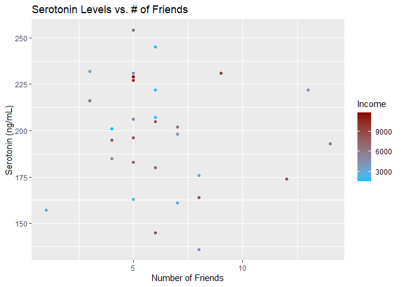
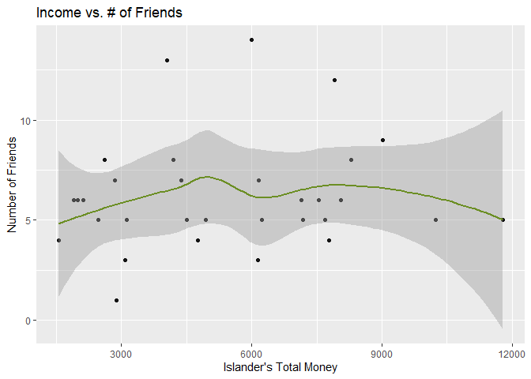
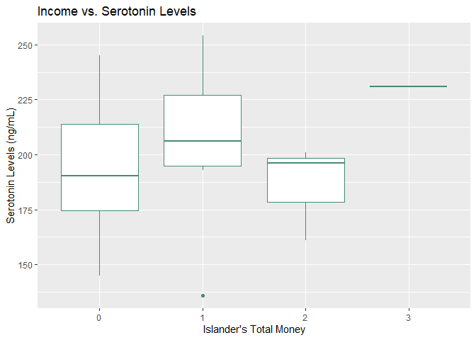
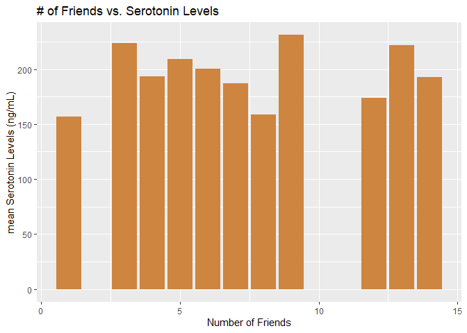

The Islands, Part 2: Study
================
Carter, Swasti, Emery
2025 - 4 - 3

- [Grading Rubric](#grading-rubric)
  - [Individual](#individual)
  - [Submission](#submission)
- [Setup](#setup)
  - [**q1** Planning a study (TEAMWORK)](#q1-planning-a-study-teamwork)
  - [**q2** EDA](#q2-eda)
  - [**q3** Key Analyses](#q3-key-analyses)
  - [**q4** Answers](#q4-answers)

*Purpose*: This is part 2 of 2. In part 1 you *planed* your statistical
project, particularly your data collection. In this part you will give
updates on your plan, and report your findings.

This challenge is deliberately shorter so you have time to collect and
analyze your data.

*Important note*: While we expect that you did your data collection with
your team, you need to complete your own individual report for c10.

<!-- include-rubric -->

# Grading Rubric

<!-- -------------------------------------------------- -->

Unlike exercises, **challenges will be graded**. The following rubrics
define how you will be graded, both on an individual and team basis.

## Individual

<!-- ------------------------- -->

| Category | Needs Improvement | Satisfactory |
|----|----|----|
| Effort | Some task **q**’s left unattempted | All task **q**’s attempted |
| Observed | Did not document observations, or observations incorrect | Documented correct observations based on analysis |
| Supported | Some observations not clearly supported by analysis | All observations clearly supported by analysis (table, graph, etc.) |
| Assessed | Observations include claims not supported by the data, or reflect a level of certainty not warranted by the data | Observations are appropriately qualified by the quality & relevance of the data and (in)conclusiveness of the support |
| Specified | Uses the phrase “more data are necessary” without clarification | Any statement that “more data are necessary” specifies which *specific* data are needed to answer what *specific* question |
| Code Styled | Violations of the [style guide](https://style.tidyverse.org/) hinder readability | Code sufficiently close to the [style guide](https://style.tidyverse.org/) |

## Submission

<!-- ------------------------- -->

Make sure to commit both the challenge report (`report.md` file) and
supporting files (`report_files/` folder) when you are done! Then submit
a link to Canvas. **Your Challenge submission is not complete without
all files uploaded to GitHub.**

# Setup

<!-- ----------------------------------------------------------------------- -->

``` r
library(tidyverse)
```

    ## ── Attaching core tidyverse packages ──────────────────────── tidyverse 2.0.0 ──
    ## ✔ dplyr     1.1.4     ✔ readr     2.1.5
    ## ✔ forcats   1.0.0     ✔ stringr   1.5.1
    ## ✔ ggplot2   3.5.1     ✔ tibble    3.2.1
    ## ✔ lubridate 1.9.4     ✔ tidyr     1.3.1
    ## ✔ purrr     1.0.2     
    ## ── Conflicts ────────────────────────────────────────── tidyverse_conflicts() ──
    ## ✖ dplyr::filter() masks stats::filter()
    ## ✖ dplyr::lag()    masks stats::lag()
    ## ℹ Use the conflicted package (<http://conflicted.r-lib.org/>) to force all conflicts to become errors

``` r
library(rsample)

# TODO: Include any other packages you need
```

### **q1** Planning a study (TEAMWORK)

While you provided this plan in c08 (Part 1), please include your plan
here. In particular, describe how you updated your plan in response to
feedback.

#### **Population**

- We’re interested specifically in studying older adults who are close
  to the retirement age, ages roughly 60-65. To narrow down our
  population, we are studying only the residents in Arcadia. We are
  aiming for 10% of this population

#### **Quantity of interest**

- Relative “happiness” of the people being studied, quantified through
  serotonin.

- Number of current friends

  - Counting all the platonic relationships formed and lasted to current
    day

  - Ex. a childhood friend from age 12 that died at age 45 would not
    count

  - Ex. a spouse does not count as a friend. 

#### **Covariates**

- Income

  - Level of income could be a covariate that affects the level of
    measured happiness

- Job Status

  - Being retired or still working could be a covariate that affects the
    levels of happiness

- Recent loss (death) in past two years 

  - Experiencing a recent death could be a covariate that affects the
    level of measured happiness despite number of current friends

- Relationship status

  - Having a current partner could be a covariate that affects the level
    of measured happiness

- Serotonin variance over time 

  - Serotonin measures mood so it is possible that a given participant
    has a non-stable mood and could be a covariate that affects the
    level of measured happiness

    - To do this we took a second measurement of serotonin after several
      hours to see if there was variability for any participants

#### **Observation or experiment?**

The Islands allows you to ask islanders to complete tasks. If you just
take measurements on your participants, then it’s an observational
study. But if you also introduce something that’s meant to change the
outcome of a measurement (e.g., drinking coffee before taking a test),
that’s called an experimental study. You need to decide whether your
study is observational or experimental.

- This is an observational study

#### **Question / Hypothesis**

- How are the number of lasting friendships and serotonin levels related
  in older adults in Arcadia?

**Sampling plan**

- To collect this group of people we went into the birth records for
  Arcadia and randomly selected individuals from the total list. 

  - We first took a full list of individuals born during selected years
    300-305 and pasted them into a google sheet and in a new tab
    randomly selected 10% of the total population pool.

  - For individuals who were deceased or did not give consent we chose
    the immediate next available person from the list.

- In the same spreadsheet we documented the primary quantity of interest
  (number of lasting friendships) and all the of the aforementioned
  covariates

  - Counting the number of lasting friendships was done manually going
    through each surveyor’s timeline

  - All other covariates were lifted straight from the surveyor’s bio

- This random sampling of 10% of the will ensure a representative sample
  while still maintaining a feasible sample size for us conducting the
  survey

### **q2** EDA

Conduct an EDA on your data. Add as many code chunks as you need. Ensure
your EDA gives enough context of the data for us to understand what
comes next in this report.

``` r
island_csv <- "./data/Data Science C10 - Sheet2 (1).csv"

df_island <-
  read_csv(
    island_csv,
  ) %>%
  rename(
    Serotonin = "Serotonin (ng/mL)",
    `Serotonin 2` = "Serotonin 2 (ng/mL)",
    Loss = "Loss (in past 2 year)"
  )
```

    ## Rows: 31 Columns: 11
    ## ── Column specification ────────────────────────────────────────────────────────
    ## Delimiter: ","
    ## chr (6): Birthday, Name, Dead or Alive, Consent, Job Title, Relationship Status
    ## dbl (4): Loss (in past 2 year), Number of Friends, Serotonin (ng/mL), Seroto...
    ## num (1): Income
    ## 
    ## ℹ Use `spec()` to retrieve the full column specification for this data.
    ## ℹ Specify the column types or set `show_col_types = FALSE` to quiet this message.

``` r
df_island
```

    ## # A tibble: 31 × 11
    ##    Birthday Name        `Dead or Alive` Consent  Loss `Number of Friends` Income
    ##    <chr>    <chr>       <chr>           <chr>   <dbl>               <dbl>  <dbl>
    ##  1 16/301   Kyle McCar… Alive           Yes         1                   5   6226
    ##  2 21/304   Louis Jack… Alive           Yes         2                   7   2848
    ##  3 26/302   Marcel Cla… Alive           Yes         0                   8   8284
    ##  4 02/300   Jessica Mu… Alive           Yes         1                   3   3088
    ##  5 20/301   Sigrid Sor… Alive           Yes         0                   6   2125
    ##  6 11/304   Lawrence M… Alive           Yes         0                   4   4755
    ##  7 08/301   Rina McCar… Alive           Yes         0                   6   1899
    ##  8 11/304   Ruddy Bouv… Alive           Yes         0                   6   7140
    ##  9 16/304   Samantha K… Alive           Yes         0                   5   3116
    ## 10 18/305   Lauren Pri… Alive           Yes         2                   5   7697
    ## # ℹ 21 more rows
    ## # ℹ 4 more variables: `Job Title` <chr>, `Relationship Status` <chr>,
    ## #   Serotonin <dbl>, `Serotonin 2` <dbl>

``` r
df_island %>%
  ggplot(
    aes(x = `Number of Friends`, y = Serotonin, color = Income)
  ) +
  geom_point() +
  scale_color_gradient(low = "deepskyblue", high = "darkred")+
labs(
  title = "Serotonin Levels vs. # of Friends",
  x = "Number of Friends",
  y = "Serotonin (ng/mL)",
)
```

<!-- -->

``` r
df_island %>%
  ggplot(
    aes(x = Income, y = `Number of Friends`)
  ) +
  geom_point(color = "gray8") +
  geom_smooth(color = "olivedrab")+
labs(
  title = "Income vs. # of Friends",
  x = "Islander's Total Money",
  y = "Number of Friends",
)
```

    ## `geom_smooth()` using method = 'loess' and formula = 'y ~ x'

<!-- -->

``` r
df_island %>%
  ggplot(
    aes(x = `Relationship Status`, y = Serotonin)
  ) +
  geom_boxplot(color = "darkred") +
labs(
  title = "Income vs. Serotonin Levels",
  x = "Islander's Total Money",
  y = "Serotonin Levels (ng/mL)",
)
```

<!-- -->

``` r
df_island %>%
  ggplot(
    aes(x = as.character(Loss), y = Serotonin)
  ) +
  geom_boxplot(color = "aquamarine4") +
labs(
  title = "Income vs. Serotonin Levels",
  x = "Islander's Total Money",
  y = "Serotonin Levels (ng/mL)",
)
```

<!-- -->

``` r
df_island %>%
  group_by(`Number of Friends`) %>%
  summarize(mean = mean(Serotonin)) %>%
  ggplot(
    aes(x = `Number of Friends`, y = mean)
  ) +
  geom_col(fill = "peru")+
labs(
  title = "# of Friends vs. Serotonin Levels",
  x = "Number of Friends",
  y = "mean Serotonin Levels (ng/mL)",
)
```

<!-- -->

### **q3** Key Analyses

Present the key analyses that support your questions / hypotheses. This
could include summary statistics (e.g., a proportion of Islanders),
grouped summary statistics (e.g., a proportion for group A, and for
group B), or visualizations (e.g., a histogram). This section should be
short, and every analysis should directly relate to q4.

There was not a strong correlation between:

- Number of friends and serotonin level

- Income and serotonin level

- Income and number of friends

- Number of personal losses in the last 2 years and serotonin

### **q4** Answers

Connect your Key Analyses to your questions / hypotheses. What did you
conclude from your study?

Overall, we concluded that serotonin is not an insightful metric for
studying the overall happiness of the older islanders. While we had
hoped serotonin could be a proxy for happiness, the serotonin levels in
the islander’s lives did not appear to be affected by environmental
factors such as number of friends, income, or recent deaths. Further,
serotonin levels were very consistent day to day when measured several
days apart, showing no major variation. If the islanders have moods, day
to day variation did not appear to influence serotonin levels.

In real humans, research suggests that, contrary to popular beliefs,
doing things that make you “happy” doesn’t necessarily correlate to a
“serotonin boost” \[1\]. Rather, the relationship is more of a
pre-requisite, where adequate serotonin levels enable such experiences
while a decreased serotonin level leads to depression. Most healthcare
sources state that the best interventions to increase serotonin are
through more physical behaviors - getting more sunlight, exercising,
eating more tryptophan (an amino acid that aids in serotonin production)
rich fruits and vegetables - rather than the social behaviors we tested
for in this study \[2\]. This research helps to explain the lack of
correlation between the variables observed in our study and the
serotonin levels given that we focused mainly on the impact of social
behaviors.

Without additional data that could more accurately quantify the
islander’s mood, it is hard to discern whether the inconclusiveness of
our collected data results from serotonin not being an accurate proxy
for happiness, or whether the values studied truly do not influence the
objective happiness of an islander.

Further, it is important to qualify these results with the fact that the
islanders are not real people. Despite the incredible detail that exists
in this simulation, the islanders don’t in fact have real brain
chemistry, and little is publicly documented about how the huge number
of metrics available about each islander is calculated. As such, for
something as individual and bio-driven (and presumably hard to
accurately model) that serves as one small statistic among a sea of
possible survey topics, the real-world accuracy of the covariance
between serotonin and other factors is unknown at best.

Sources:

\[1\] Cleveland Clinic, “Serotonin,” *Cleveland Clinic*, Mar. 18, 2022.
<https://my.clevelandclinic.org/health/articles/22572-serotonin>

\[2\] S. Watson, “Serotonin: The natural mood booster,” *Harvard
Health*, Nov. 20, 2023.
<https://www.health.harvard.edu/mind-and-mood/serotonin-the-natural-mood-booster>
